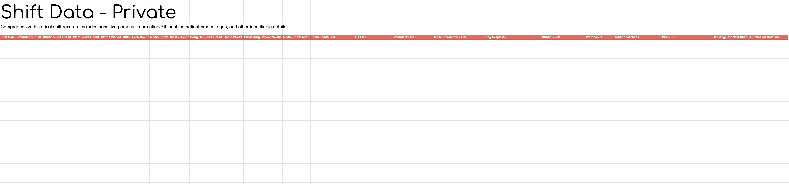
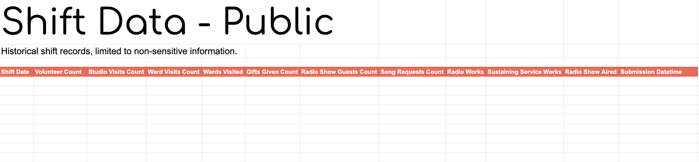
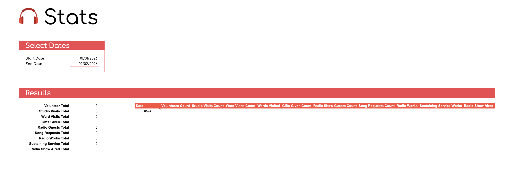

# Hospital Radio Patient Tracker

A project for a childrens hospital radio charity.

A Google Sheets add-on for a hospital radio= to log shift activity — studio visits, ward visits, song requests, volunteer details, and messages between shifts. Shift data is automatically compiled into a stats spreadsheet for reporting.

Built with Google Apps Script.

---

## How It Works

Volunteers fill in two forms during their shift — the **Studio form** and the **Wards form**. On submit, the data is aggregated into a single row and appended to a data spreadsheet (plus a backup). A previous shift's message is automatically displayed when the sheet loads.

---

## Spreadsheet: Studio Forms

### Studio — Form (Main)

The main form filled in each shift.

- **Admin** — date, team leads, DJs, on-shift volunteers, makeup volunteers
- **Flags** — radio works, external service works, radio show aired
- **Notes** — additional notes, wrap-up, message for the next shift
- **Studio Visits** — per-patient: name, age, activities, gifts given, radio show appearance
- **Song Requests** — patient name and requested song

.png)

---

### Volunteers List

A master list of volunteer names. Used to power the dropdown autocomplete in the Studio form volunteer fields. Names are auto-trimmed on edit.


---

### Wards — Form

Filled in alongside the Studio form to record ward round activity.

- **Nurses Station** — per-ward notes: please visit, do not visit, can/can't visit studio, airways status, COVID status
- **Ward Visits** — per-patient: ward, bed, name, age, activities, gifts given


---

## Spreadsheet: Studio Stats & Data

### Shift Data — Private

Full historical shift records. Contains all 22 columns of submitted data including patient names, ages, volunteer lists, visit narratives, and shift notes. Contains PII — kept private.



---

### Shift Data — Public

Anonymised view of shift records. Contains only aggregate counts and flags — no patient or volunteer names. Safe to share.



---

### Stats

Date-range dashboard that pulls from the public data. Enter a start and end date to get aggregated totals across: volunteers, studio visits, ward visits, gifts given, radio guests, song requests, radio works, sustaining service, and radio show aired.



---

## Project Structure

```
hospital-radio-patient-tracker/
├── src/
│   ├── events.js          # Triggers and button handlers (submit, clear, onEdit)
│   ├── helper.js          # Shared utilities (sheet access, dialogs, buildRowData)
│   ├── studioSheet.js     # Studio form data extraction and formatting
│   ├── wardSheet.js       # Ward form data extraction and formatting
│   └── appsscript.json    # Apps Script manifest
├── assets/
│   ├── studio-forms/      # Screenshots of input form sheets
│   └── studio-stats-and-data/  # Screenshots of data/stats sheets
└── .gitignore
```
